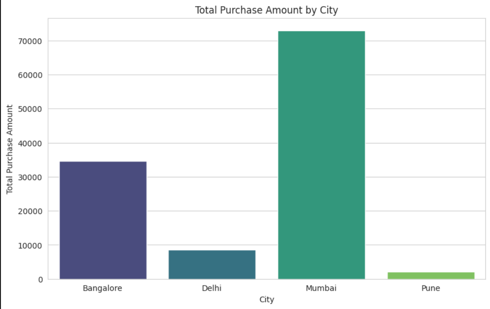
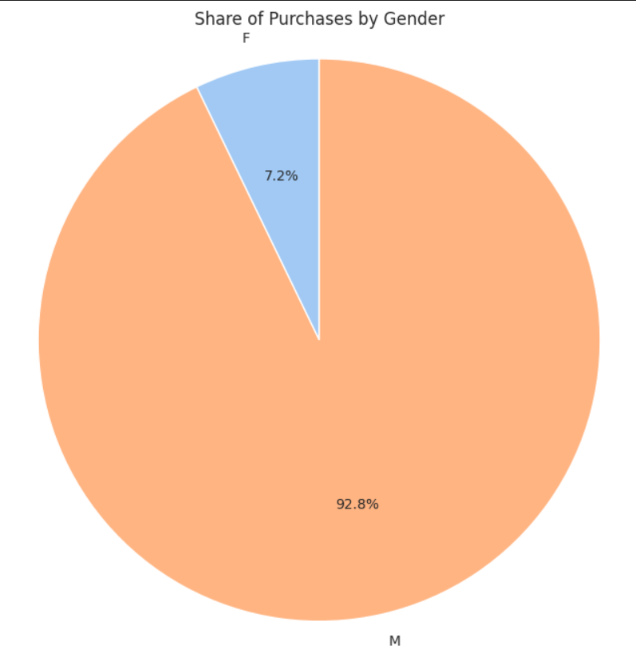
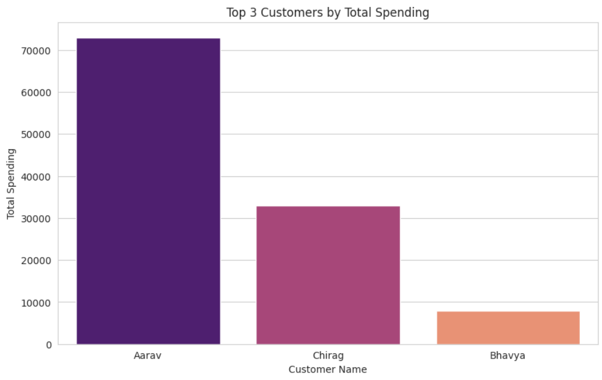
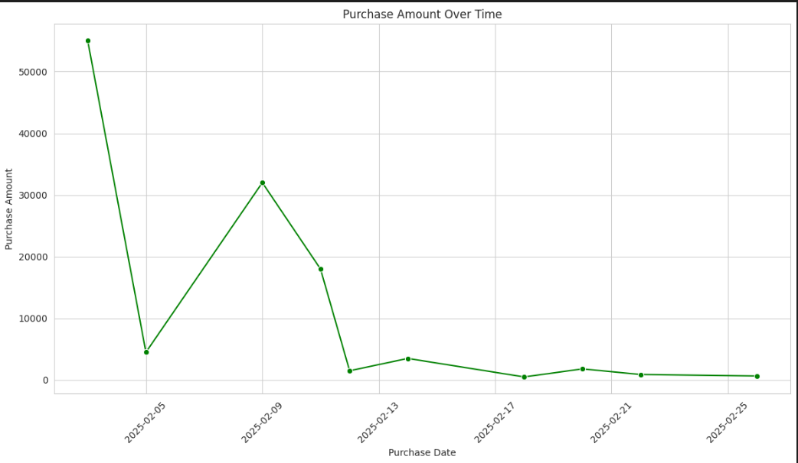

# iStudio Data Analytics Internship — Assignment 2

## 📊 Customer & Purchase Data Analysis

This project is the second assignment completed as part of the **iStudio Data Analytics Internship**. The assignment focuses on applying Python-based data analytics techniques using **NumPy, Pandas, Matplotlib, and Seaborn**.

The analysis works with customer and purchase datasets to demonstrate data manipulation, filtering, grouping, merging, and visualization techniques.

---

## 🎯 Objectives

- Practice Python fundamentals for data analytics
- Perform numerical operations using NumPy
- Create and manipulate Pandas DataFrames
- Identify and handle missing values
- Merge customer and purchase datasets
- Filter and group data based on analytical conditions
- Calculate customer and purchase-level metrics
- Create meaningful visualizations from the analyzed data

---

## 📂 Dataset

The project uses two CSV datasets:

### Customers Dataset

Contains customer-level information:

- Customer ID
- Name
- City
- Age
- Gender

### Purchases Dataset

Contains transaction-level information:

- Purchase ID
- Customer ID
- Product
- Purchase Amount
- Purchase Date

The customer and purchase datasets are connected using the `cust_id` field.

---

## 🛠️ Technologies Used

- **Python**
- **NumPy**
- **Pandas**
- **Matplotlib**
- **Seaborn**
- **Jupyter Notebook / Google Colab**

---

## 🔍 Analysis Performed

### 1. Python & NumPy

- Python variables and data types
- Arithmetic operators
- Comparison and logical operators
- NumPy arrays
- Array properties
- Statistical calculations
- Array reshaping
- Conditional indexing
- Difference calculations using `np.diff()`

The assignment also demonstrates basic sales-array calculations such as mean, minimum, maximum, standard deviation, and sequential growth.

### 2. Pandas DataFrames

Customer and purchase DataFrames were created and analyzed using Pandas.

Key operations included:

- DataFrame creation
- Data inspection
- Missing-value identification
- Missing-value handling
- DataFrame merging
- Column operations
- Data transformation

### 3. Data Filtering & Grouping

The merged customer-purchase data was analyzed using filtering and grouping operations.

Examples include:

- Filtering records based on conditions
- Grouping purchases by customer
- Calculating number of purchases per customer
- Identifying top customers by total spending
- Aggregating purchase amounts by different dimensions

### 4. Data Visualization

The analysis includes the following visualizations:

#### Total Purchase Amount by City

Shows the total purchase value generated across different cities.



#### Share of Purchases by Gender

Shows the distribution of purchase value across genders.



#### Top 3 Customers by Total Spending

Highlights the customers with the highest total spending.



#### Purchase Amount Over Time

Shows purchase amounts across the transaction dates.



---

## 📈 Key Analytical Outputs

The analysis identifies customer-level and city-level purchase patterns.

For example, the top three customers by total spending were:

| Customer | Total Spending |
|----------|---------------:|
| Aarav    | ₹73,000 |
| Chirag   | ₹32,899 |
| Bhavya   | ₹8,000 |

These results were calculated after combining customer and purchase information.

---

## 📁 Project Structure

```text
Retail-Sales-Customer-Analytics/
│
├── data/
│   ├── customers.csv
│   └── purchases.csv
│
├── images/
│   ├── total-purchase-amount-by-city.png
│   ├── share-of-purchases-by-gender.png
│   ├── top-3-customers-by-total-spending.png
│   └── purchase-amount-over-time.png
│
├── Istudio_Assignment_2.ipynb
├── README.md
└── requirements.txt
```

---

## 🚀 How to Run

### 1. Clone the repository

```bash
git clone https://github.com/maneeshreddy79/Retail-Sales-Customer-Analytics.git
```

### 2. Navigate to the project directory

```bash
cd Retail-Sales-Customer-Analytics
```

### 3. Install dependencies

```bash
pip install -r requirements.txt
```

### 4. Open the notebook

Open:

```text
Istudio_Assignment_2.ipynb
```

You can run the notebook using **Jupyter Notebook, JupyterLab, or Google Colab**.

---

## 💡 Skills Demonstrated

This assignment demonstrates practical exposure to:

- Python for Data Analytics
- NumPy
- Pandas
- Data Cleaning
- Missing Value Handling
- DataFrame Merging
- Data Filtering
- Data Grouping
- Aggregation
- Exploratory Data Analysis
- Data Visualization
- Matplotlib
- Seaborn
- Basic Business Data Analysis

---

## 🎓 Internship Context

**Program:** iStudio Data Analytics Internship  
**Assignment:** Assignment 2  
**Focus:** Python, NumPy, Pandas, Data Manipulation & Visualization  
**Student:** Veluru Maneesh Kumar Reddy  
**Date:** July 2026

---

## 📌 Note

This repository represents an internship assignment focused on developing foundational data analytics skills. It is maintained as part of the overall analytics learning portfolio and is not presented as a large-scale independent business analytics project.